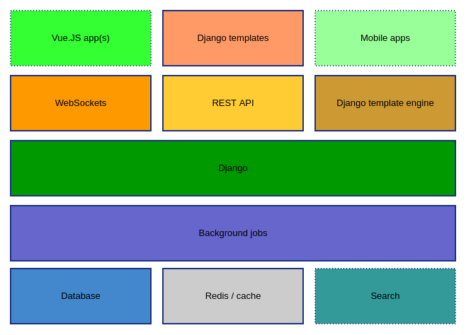
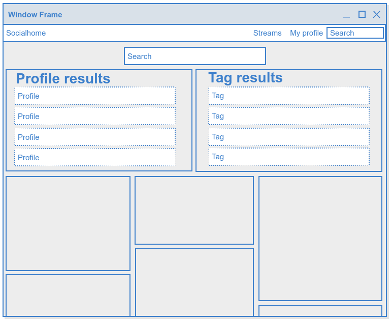

.. _architecture:

Architecture
============

Some details on the architecture and future high level plans for Socialhome.

Component map
-------------

Our current and future (dotted lines) components look something like this:

At the lowest level we have the database (**PostgreSQL**) and **Redis** based cache / queue storage. Search is currently powered by **Django-Haystack + Whoosh**.

On top of this we have the background jobs, which are powered by **RQ**.

In the middle sits **Django**.

To provide data for the frontend we have 3 solutions - **WebSockets** (powered by **Channels**), a **REST API** powered by **Django REST framework** and **Django** template engine itself.

For the frontend, we will have 3 solutions. Currently everything is **Django templates**. We will want to keep some of the pages as Django templates. For the streams (and possibly other pages), we want to create a **Vue.js** app. Additionally, **mobile apps** would be provided.

Component and feature notes
---------------------------

Vue.js app(s)
.............

The current streams JavaScript is largely based on lots of **jQuery** events modifying the DOM. Since the streams can grow to be quite big, this results in very bad performance. Additionally, the code is beginning to get hard to read and difficult to modify without regressions ("spaghetti code").

What we want to do is rewrite the streams as a more modern performant JS application. For the framework, discussion has been centering around **Vue.js**. The rationale is that Vue has the benefits of React.js with less overhead in learning curve and development time.

Why not replace the whole frontend with Vue.js? Simply because we want to use the best job for each software area. Some of the pages will not benefit from being rewritten in JavaScript. Django templates are powerful and fast to develop. But some parts, like the streams, will benefit hugely from features like the virtual DOM provided by Vue, in addition to allowing cleaner JavaScript code base.

Code layout
:::::::::::

Socialhome code layout is split into logical Django apps based on the feature provided. The JS code should follow this pattern and live in the respective app. For example for the ``streams`` Vue.js application, the following code layout would make sense:

::

    socialhome/
      streams/
        app/
          components/
            (components)
          App.vue
          main.js
        templates/
          streams/
            app.html
        views.py

Basically the idea is that ``views.py`` contains a Django view that loads the template inheriting from ``base.html``. The template then injects the Vue app, loading the stream. To speed up rendering we provide some initial stream data in the Django template context, then continuing everything via the REST API.

All the Vue apps build configuration should be on the top level of Socialhome, set up so all the apps build using the same ``npm`` commands. Each Vue.js app should however generate its own JS bundle file.

Code style
::::::::::

For the new Vue.js based JavaScript we should follow the popular `Airbnb guidelines <https://github.com/airbnb/javascript>`_ with the following exceptions:

* No semicolons. This is a Python project, we can go for more Pythonic looking JavaScript.

All code should be allowed ES7 features, using Babel to transpile.

Tests
:::::

We should use standard testing tools for the Vue apps code, for example **Karma** + **Mocha**.

Timeline
::::::::

Since this is a huge task which cannot be done at once, the new Vue.js based streams will be provided in addition to the current streams served by Django templates. This could be done in phases:

1. Alpha, little functionality - Render using Vue.js if a parameter `?vue` passed in the url.
2. Beta, most of the functionality present - Allow user to go to preferences and choose whether to see the new or legacy stream.
3. Final, all functionality covered - Make Vue based streams default, removing the old streams code.

Tracking issue
::::::::::::::

The Vue.js streams rewrite is tracked `in this issue <https://github.com/jaywink/socialhome/issues/202>`_.

Search
......

Search is currently powered by `django-haystack <http://django-haystack.readthedocs.io>`_ as the framework and `Whoosh <https://whoosh.readthedocs.io>`_ as the engine. Whoosh is a pure Python backend with a file based search index. As performance requirements increase (for example full text content search), we should offer the option to use `Elasticsearch <https://www.elastic.co/products/elasticsearch>`_ as an optional search backend. Django-haystack supports both backends with just configuration changes. Whoosh should still be the default since it doesn't require extra installations like Elasticsearch does.

The global search works as follows, in this order:

- Search by profile handle:

  - If direct match found -> render profile
  - If remote match found -> fetch and render profile

- Search all indexes for any matches

Indexes
:::::::

Currently a search index only exists only for profile objects. The plan is to add the following search indexes:

* Tags
* Content

UI
::

Profiles and tags can be easily listed in a list or table structure. Content would make sense to be rendered in a normal grid. This would make the search results page just another (dynamic) stream. See below mockup.

Streams
.......

There are many streams in Socialhome. The main streams are user profiles, followed and the public stream, but basically each single content view is also a stream. Opening a reply in an individual window would also create a stream for that reply content. Additionally, we want users to be able to create custom streams according to rules. For example, a stream could be "followed profiles + tag #foobar + tag #barfoo".

A stream should automatically subscribe the user using websockets and handle any incoming messages from the server (currently in ``socialhome/static/js/streams.js``), notifying the user of new content and adding it to the page on request (without a page load).

This basic design should be kept in mind when touching stream related code.

Stream templates
::::::::::::::::

Content in streams in is visualized mainly as content grid boxes. This includes replies too, which mainly use the same template code.

There are a few locations to modify when changing how content is rendered in streams or the content detail view:

* ``socialhome/streams/templates/streams/base.html`` - This renders the initial stream as a basic Django template on page load.
* ``socialhome/streams/templates/streams/_grid_item.html`` - Renders actual content item in initial stream and content detial.
* ``socialhome/static/js/content.js`` - This is the main JavaScript template which is used to insert content into the stream. This is used for both top level content and replies in content streams.

All these templates must be checked when any content rendering related tweaks are done. Note however that actual content Markdown rendering happens at save time, not in the templates.

NOTE! The Vue.js streams rewrite will change templates mentioned here but shouldn't change the actual way streams work.
