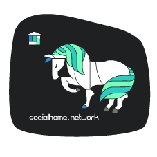

.. _brand:

Brand
=====

Documentation relating to branding of Socialhome as a product. Each server in the network is free to apply whatever branding for their particular server.

When talking about Socialhome as software or a platform, the following graphics and colour schemes should be used.

Logo
----

Our logo is available as an SVG and PNG's of various sizes. The logo comes in a dark and light variant, for different backgrounds.

The logo is contributed by `lostinlight <https://gitlab.com/lostinlight/per_aspera_ad_astra/tree/master/socialhome-concept>`_, licensed under `WTFPL <http://www.wtfpl.net/>`_.

Dark
....

**SVG**

.. image:: _static/brand/Socialhome-dark.svg

**PNG**

.. image:: _static/brand/Socialhome-dark-600.png
.. image:: _static/brand/Socialhome-dark-300.png
.. image:: _static/brand/Socialhome-dark-96.png
.. image:: _static/brand/Socialhome-dark-32.png
.. image:: _static/brand/Socialhome-dark-24.png
.. image:: _static/brand/Socialhome-dark-16.png

Light
.....

**SVG**

**PNG**

.. image:: _static/brand/Socialhome-light-600.png
.. image:: _static/brand/Socialhome-light-300.png
.. image:: _static/brand/Socialhome-light-96.png
.. image:: _static/brand/Socialhome-light-32.png

.. image:: _static/brand/Socialhome-light-16.png

Stickers
--------

Feel free to print these out and spread the love!

The stickers are contributed by `lostinlight <https://gitlab.com/distributopia/sticker-bay/tree/master/stickerpack-1>`_, licensed under CC-BY-4.0.

