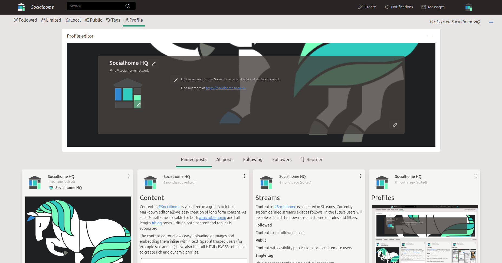

Socialhome
==========

Welcome to the documentation of Socialhome!

Description
-----------

Socialhome is best described as a federated personal profile with social networking functionality. Users can create rich content using Markdown and even HTML/JS/CSS (if set as trusted user). All content can be pinned to the user profile and all content will federate to contacts in the federated social web. Currently federation happens using the `Diaspora protocol <https://diaspora.github.io/diaspora_federation/>`_ with future plans to include at least `ActivityPub <https://www.w3.org/TR/activitypub/>`_ as well. Federating using existing protocols means Socialhome users can interact with `tens of thousands <https://the-federation.info>`_ of other users.

Please check the official site for more information about features. Naturally, the official site is a Socialhome profile itself.

Official site: https://socialhome.network

Joining
-------

Yes! The official server is open for registrations. `Sign up <https://socialhome.network/accounts/signup/>`_ and play around!

Please see the :ref:`community` pages for how to interact with the community.

Installation
------------

Please see the :ref:`installation` pages.

Running an instance
-------------------

Please see the :ref:`running` pages.

Development
-----------

Please see the :ref:`development` pages.

Source code
-----------

Socialhome is fully open source, licenced under the AGPLv3 license.

Check the code on `GitHub <https://github.com/jaywink/socialhome>`_

Table of contents
-----------------

.. toctree::
   :maxdepth: 3

   installation
   running
   development
